<!-- markdownlint-disable -->

# The forest for the _(Abstract Syntax)_ Trees

_Matt Seccafien_

React Advanced, October 2021

#### Slides: [https://forest-for-the-asts.vercel.app](https://forest-for-the-asts.vercel.app/)

---

# Hi! I'm Matt

I work at Shopify on the **Hydrogen** team


Note: Hello, My name is Matt Seccafien. I work at Shopify on the Hydrogen team.

---

## Hydrogen is an opinionated React framework and SDK for building fast and dynamic Shopify powered custom storefronts.

#### _(currently in private beta)_

Note: Hydrogen is an opinionated React framework and SDK for building fast and dynamic Shopify powered custom storefronts. We are currently in a private beta, but look out for our developer preview in the coming weeks.

---

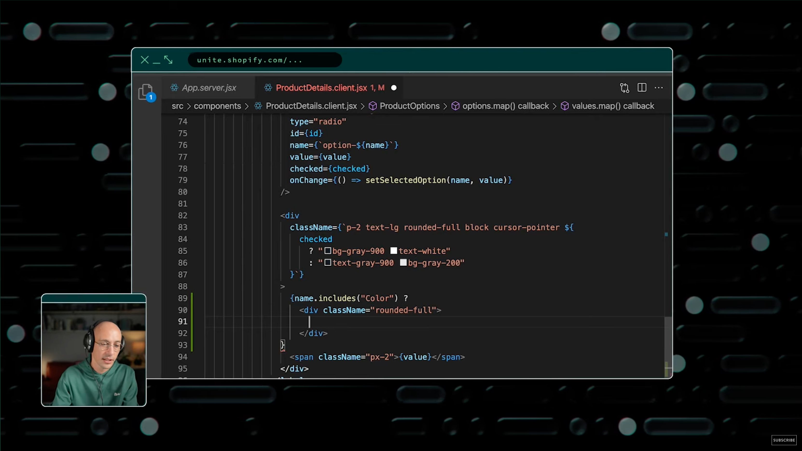

[unite.shopify.com](https://unite.shopify.com/)

Note: I'm not going to touch on the details of Hydrogen specifically, but you can watch this code demo with Tobi, the Shopify CEO, from UNITE conference 2021 earlier this year.

---

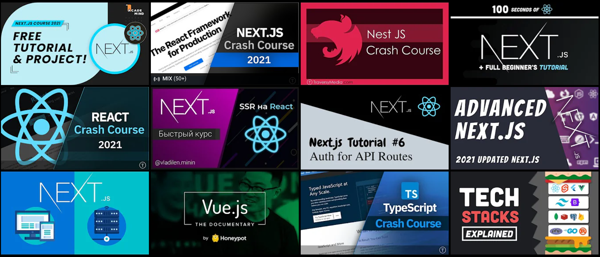

Note: Like any new framework or product, the time it takes to get up and running is crucial to the developer experience. With so many competing frameworks, all with a much longer tenure, we knew this would be an important consideration for anyone choosing to adopt Hydrogen.

---

[NextJS examples](https://github.com/vercel/next.js/tree/canary/examples)

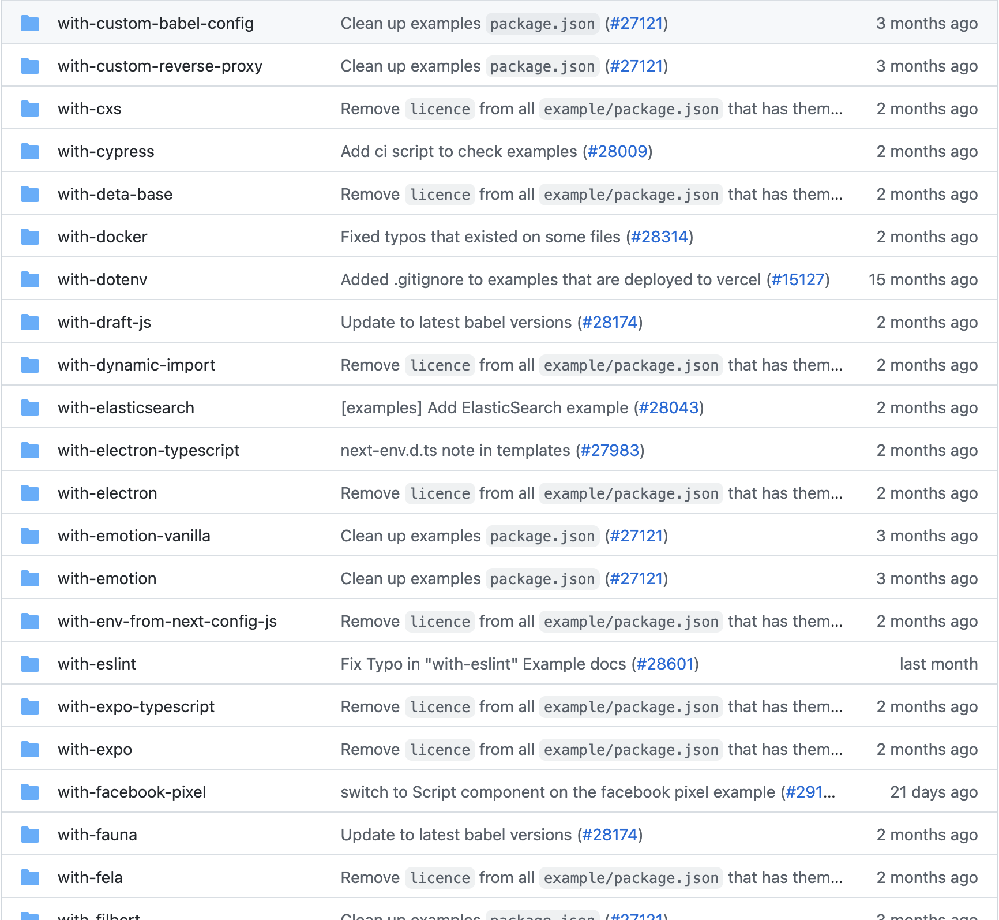

Note: Create-x scripts such as create-react-app or create-next-app are pretty standard for project bootstrapping, but many of these are currently quite limited to cloning a template directory. This is not ideal as it doesn't provide much in the way of configurations and every new configuration comes with the maintenance overhead of a completely new template, and likely a lot of duplicate code.

And the chances that any defaults within these templates will be configured exactly to your preferences is highly unlikely. You might want to add tailwind or styled components or storybook or you might install your own internal library.

---


Note:

In these cases you are left on your own to stitch together your final configuration from multiple examples, or, duplicating previous projects. All before writing a single line of actual code.

---


Note: We wanted to give developers a better place to start: a Command Line Interface that is more sophisticated, extensible and walks with developers as they build their custom commerce experience. A CLI, specific to hydrogen development, that would do more than bootstrapping projects, but that you would call out to ongoingly as you develop your project and capable of an infinite number of project configurations without additional overhead.

---

## Configuration

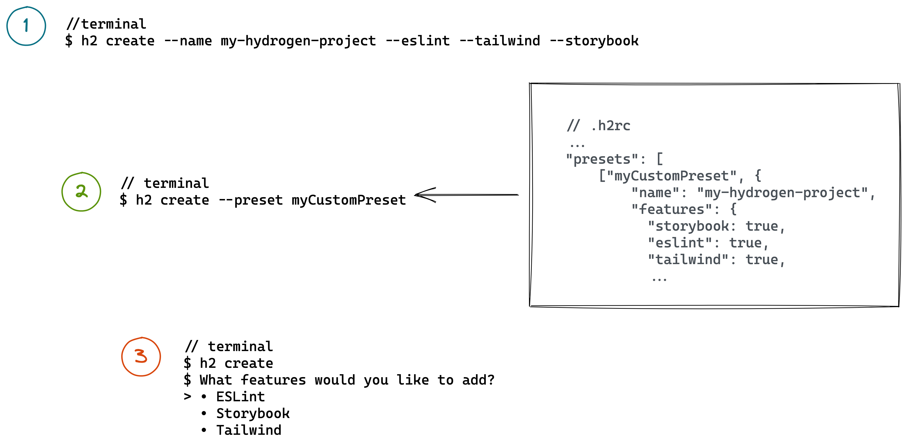

Note: Let's look at the high-level mental model of how this works.

First we gather information about the project either by the arguments in the CLI, prompts for input or a configuration file.

---

## Parsing

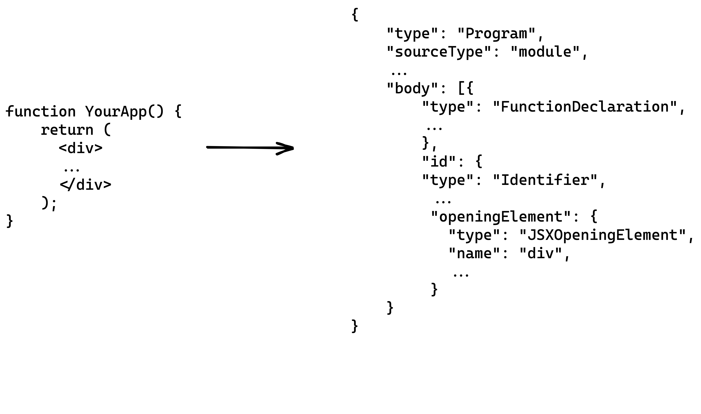

Note: Next we parse the existing project (if there is one) or start from a base Hydrogen project, and turn it into a JSON-tree-like representation, usually an Abstract Syntax Tree or AST, by flattening out all the tokens and then assigning meaning to each of them.

---

## Transform

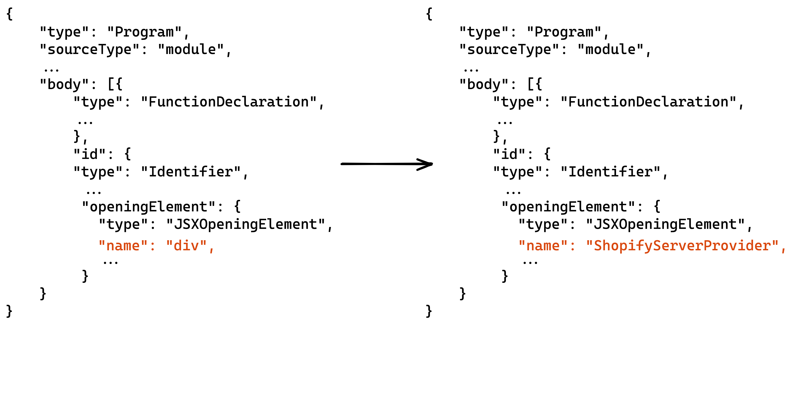

Note: We then apply transformation functions to move nodes of the JSON around, effectively manipulating the code, based on the inputs we gathered in the first stage.

---

## Generation

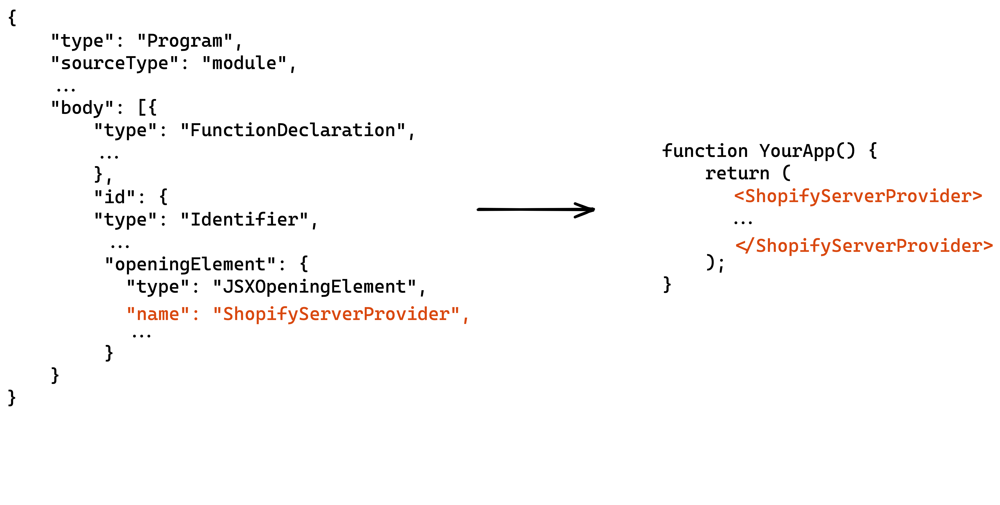

Note: And finally, we generate new code from the JSON and write that back to disk.

---

# 1. Parsing

Turn code into an syntax tree

•

# 2. Transformation

Manipulate syntax tree

•

# 3. Generation

Turn back into code

Note: These stages, Parsing, Transformation and Generation, are common to most compilers, and we are just using babel under the hood to do most of the heavy lifting.

---

[Babel](https://babeljs.io/)

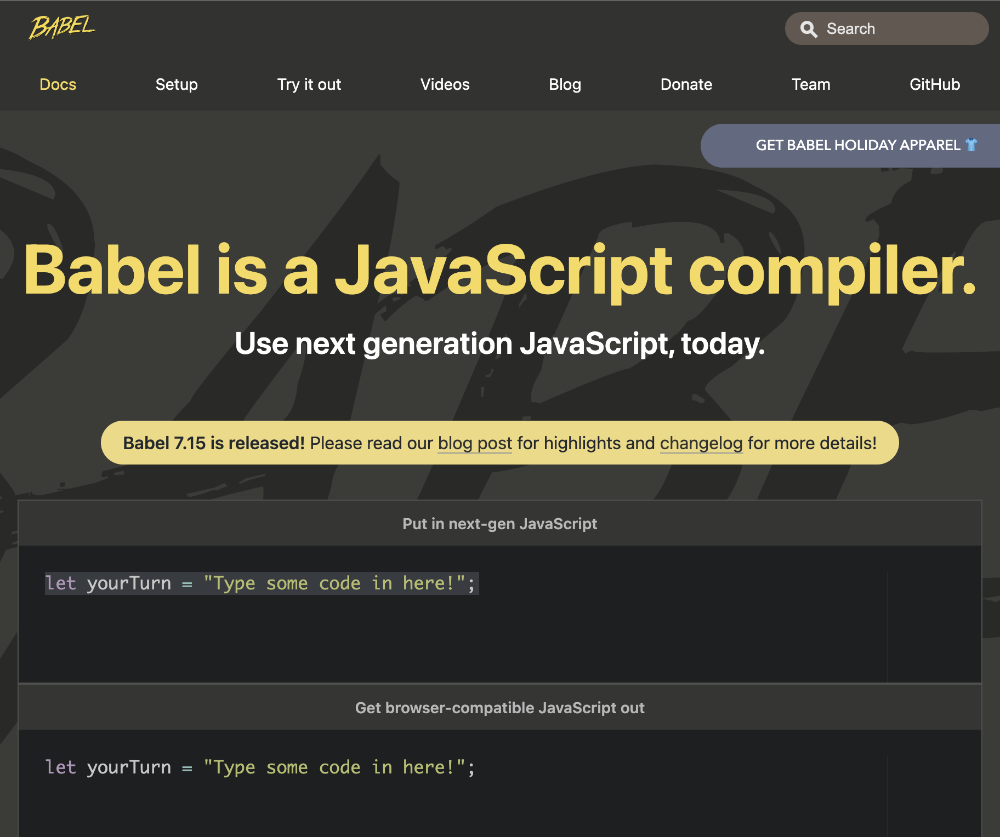

Note: For those not familiar: Babel is a tool that is most well known for being one of the first ways we began modifying code written using future Javascript features to a more browser compatible syntax.

Each stage of the compiler is dealing with a different concern. Notice that nowhere are we managing stacks of template files, such as EJS or handlebar templates. We are operating only on the AST and the transform functions are input code agnostic.

---

```js [2|3-10]
{
  JSXElement(path) {
    const {openingElement} = path.node;

    if (openingElement.name.name === 'App') {
        openingElement.attributes.push(
          t.jsxAttribute(t.jsxIdentifier('someNewProp'), 'someValue'),
        );
      });
    }
  }
  // ...other nodes we want to operate on
};
```

Note: This is because it uses a common code pattern known as the Visitor pattern that allows for many unique and unrelated operations on the AST object. A main function will start by walking or traversing the tree and match nodes with transformation functions. These functions only care about the specific nodes they operate on, and couldn't care less about the rest your code outside of those points of interest.

---

[@shopify/ast-utilities](https://github.com/Shopify/quilt/tree/main/packages/ast-utilities)

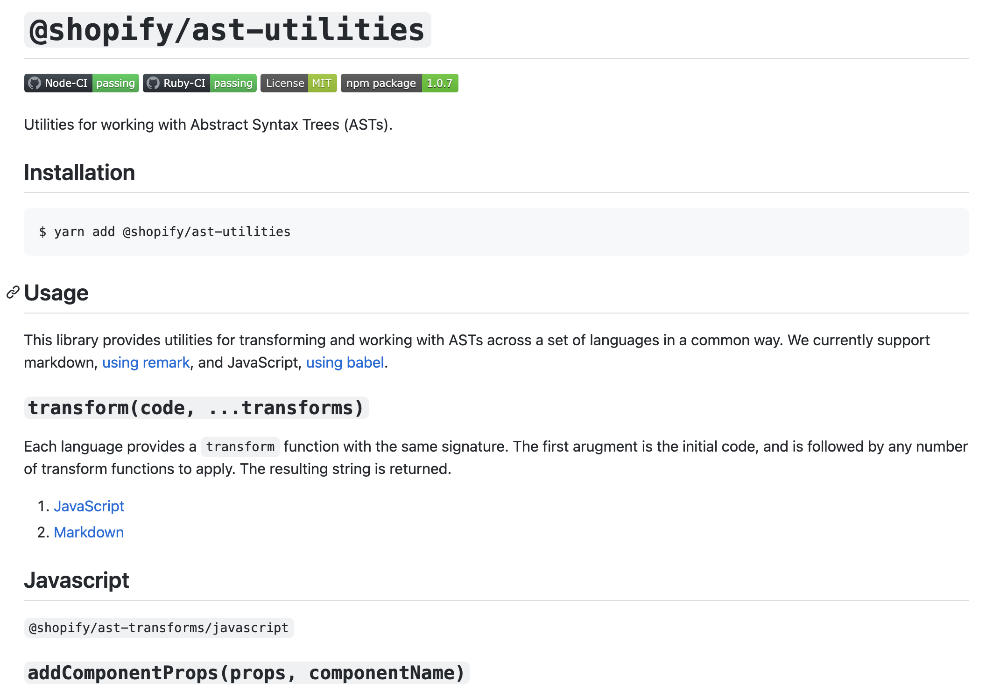

Note: Because each operation is isolated and idempotent, they behave like the component primitive in React and we can group common operations into a shared package. This makes composing a series of common transforms trivial and the syntax very approachable. There are also some great tools, such as astexplorer.net or the babel playground, that can help you write and visualize AST transforms. I have a list of resources at the end of these slides.

---

```jsx
function App() {
  return <div>{/* App contents */}</div>;
}
```

Note: Imagine being able to add Progressive Web App (PWA) support with one command. Or, for example, if we wrote a transformation that added internationalization with all the appropriate error handling and fallbacks in place.

---

```jsx [1|1,3-5|1,3-5,9,11]
import { I18nContext, I18nManager } from "@shopify/react-i18n";

const i18nManager = new I18nManager({
  locale: "en",
});

function App() {
  return (
    <I18nContext.Provider value={i18nManager}>
      {/* App contents */}
    </I18nContext.Provider>
  );
}
```

Note: At a basic level we might add an import for a Provider, use a hook, provide it some unique configuration based on your project or preferences and wrap the outer App component in the Provider, passing the result of the hook as a prop. Of course we would also install the package and all the easy things, but being able manipulate code in this way can lead to some pretty powerful and creative opportunities to help you work with hydrogen.

---


Note: With Hydrogen we want to be an opinionated framework when it matters most, but there are certain addons in your project that may not make sense for you right at the beginning. Should you decide later that the project requires it, we can provide a turn key process to add it down the road, and with all the best defaults out of the box.

---

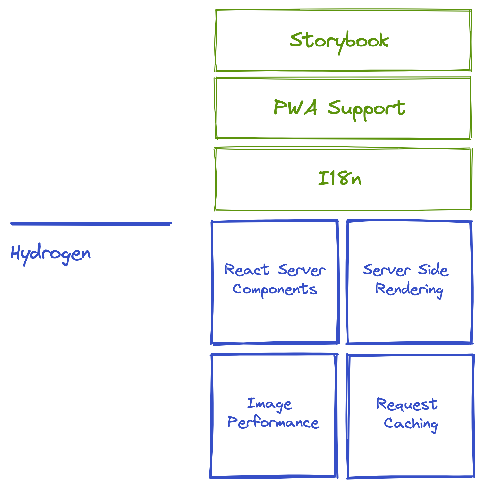

Note: So what are we opinionated about? We care about Image performance, request caching and using Server Side Rendering and React Server Components to provide non-blocking responses, and eliminating client-side waterfalls.

---

[shopify.dev](https://shopify.dev/)

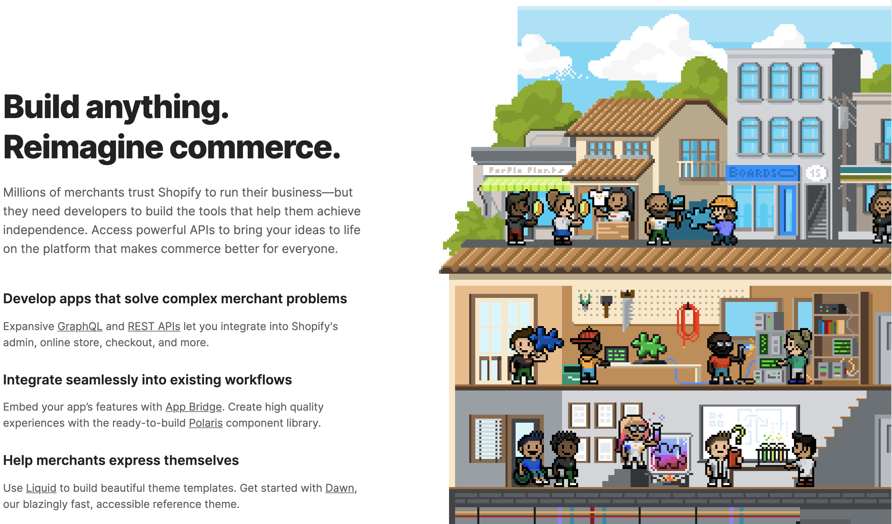

Note: At Shopify we are passionate about commerce, and we want to give the merchant developers on our platform the building blocks to build highly performant storefronts using Hydrogen. In that world we are opinionated about the difficult, but undifferentiated aspects of development and want to provide a developer experience that makes web development fun again.

Think of this as us trying to raise the floor on the areas we can, so that you can more easily raise the ceiling within the types of creative and custom commerce experiences you develop.

---

[React Server Components (RSC)](https://reactjs.org/blog/2020/12/21/data-fetching-with-react-server-components.html)

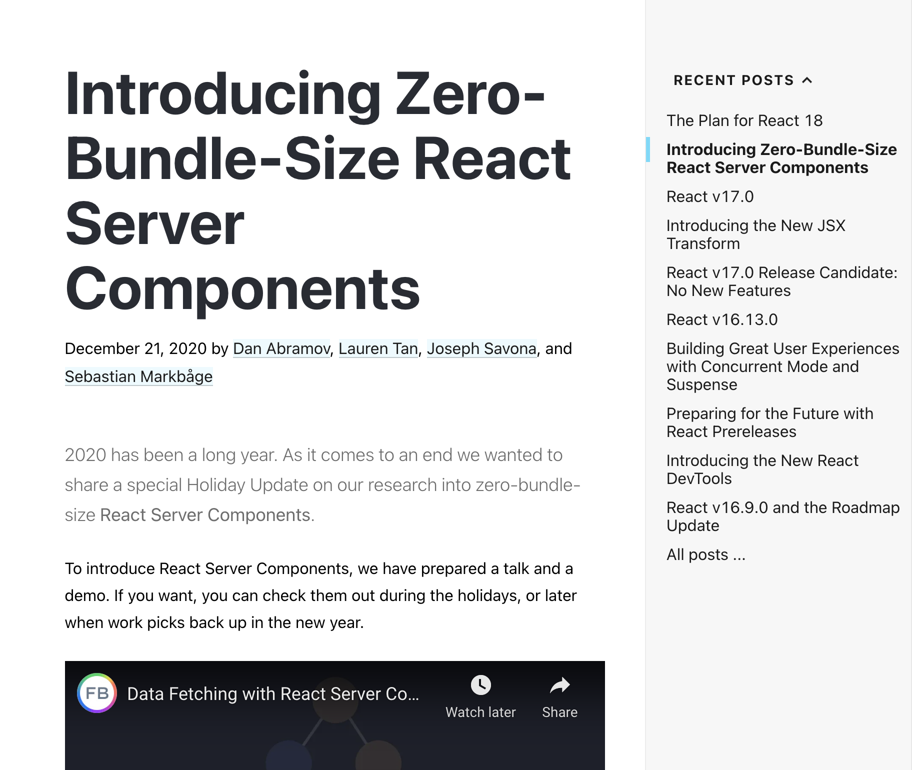

Note: Take React Server Components: probably not something you've worked a great deal with yet.

---

[RSC RFC](https://reactjs.org/blog/2020/12/21/data-fetching-with-react-server-components.html)

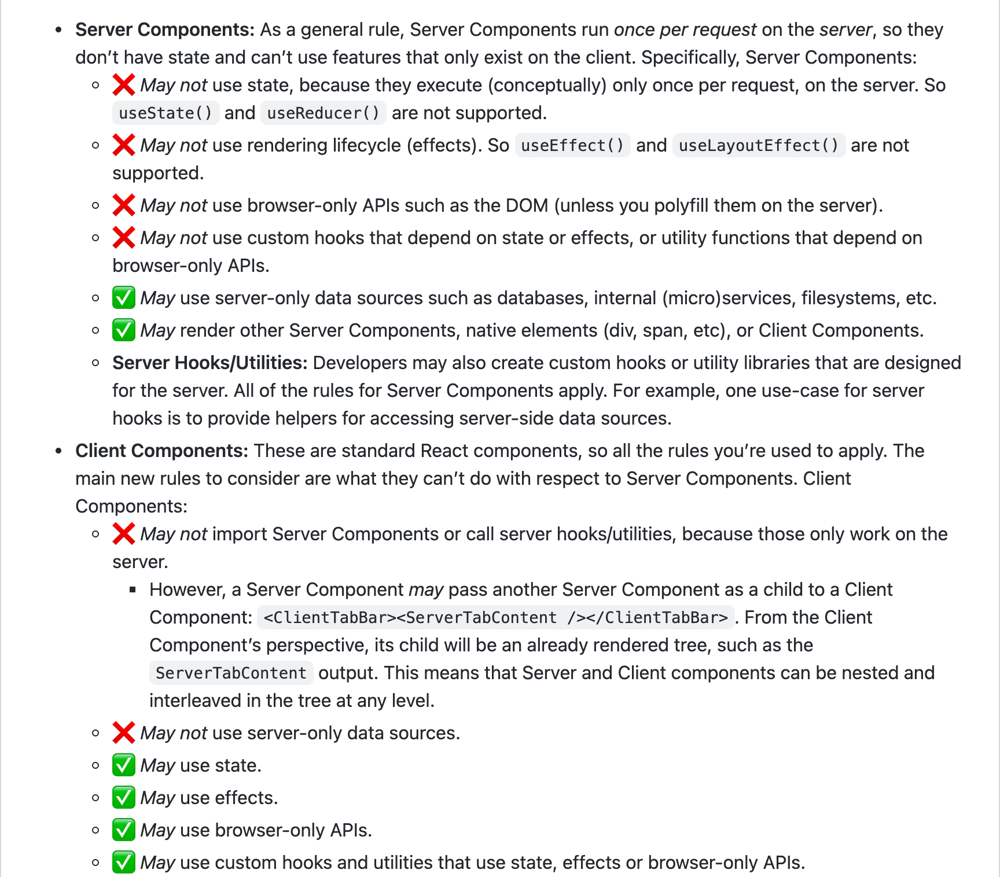

Note: Perhaps you are not sure about when a component should be a client only, server only or shared and what primitives are available in each.

---

# 1. Parsing

# 2. Transformation

# 3. Generation

Note: Well, using the same Parsing, Transforming and Generating process I outlined earlier, we can again walk with you. We can inspect for common footguns while using React Server Components and either guide you to the correct usage or just change your code for you. We can provide migrations baked directly in the the CLI that will automatically look at your project for breaking changes in new versions of Hydrogen and optionally apply a migration automatically.

---

[web.dev/conformance](https://web.dev/conformance/)

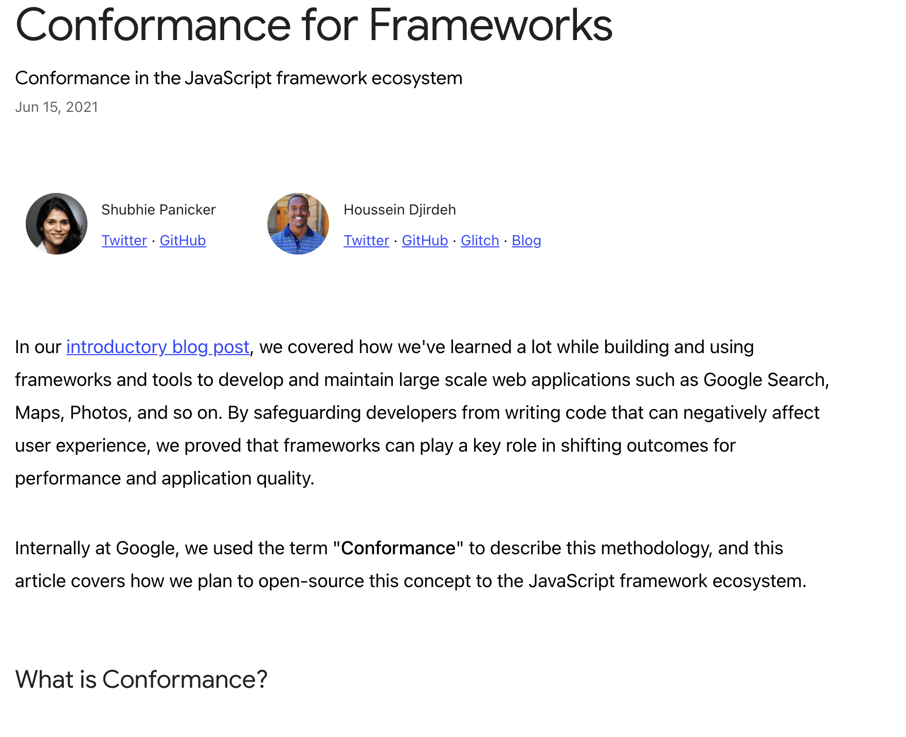

Notes: We also audit your project for accessibility and security, conformance with web vitals and any framework violations. We also use the CLI internally to power our integration tests, generating unique configurations of Hydrogen apps that we test in headless browsers for breakages. This protects ourselves from releasing new versions with unknown issues and has the added benefit of having us dogfood our own tools.

---

### Reads

- [Rome will be written in Rust by Jamie Kyle](https://rome.tools/blog/2021/09/21/rome-will-be-rewritten-in-rust)
- [Leveling Up One’s Parsing Game With ASTs by Vaidehi Joshi](https://medium.com/basecs/leveling-up-ones-parsing-game-with-asts-d7a6fc2400ff)

### Code

- [The super tiny compiler](https://github.com/jamiebuilds/the-super-tiny-compiler)
- [Ast Explorer](https://astexplorer.net/)
- [Babel REPL](https://babeljs.io/repl#?browsers=defaults%2C%20not%20ie%2011%2C%20not%20ie_mob%2011&build=&builtIns=false&corejs=3.6&spec=false&loose=false&code_lz=Q&debug=false&forceAllTransforms=false&shippedProposals=false&circleciRepo=&evaluate=false&fileSize=false&timeTravel=false&sourceType=module&lineWrap=true&presets=env%2Creact%2Cstage-2&prettier=false&targets=&version=7.15.8&externalPlugins=&assumptions=%7B%7D)

### Support

- [Babel on Open Collective](https://opencollective.com/babel)

Note: So this has been a quick dive under the hood of how are leveraging compilers with everything from bootstrapping to enforcing best-practises to ongoing maintenance support and even internal testing. With the Hydrogen CLI, each of these interactions culminates into a powerful and fun developer experience.

---

# Thank you

## [Instagram](https://www.instagram.com/cartogram) / [LinkedIn](https://www.linkedin.com/in/mattseccafien/) / [Twitter](https://twitter.com/crtogrm)

Note: Thanks for hearing my talk and if you have any questions or want to shoot me a message, I'm not so big on social media, but you can find me as cartogram in most places.

Okay, enjoy the rest of the conference.
